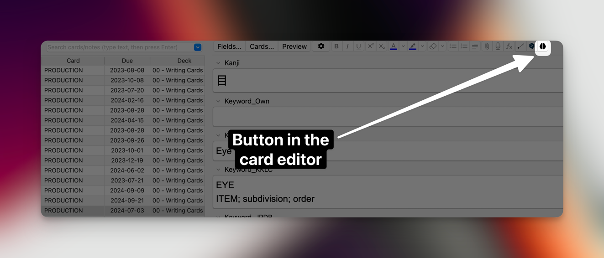
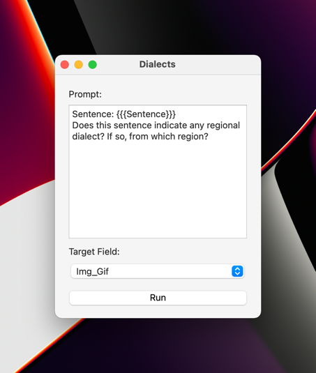
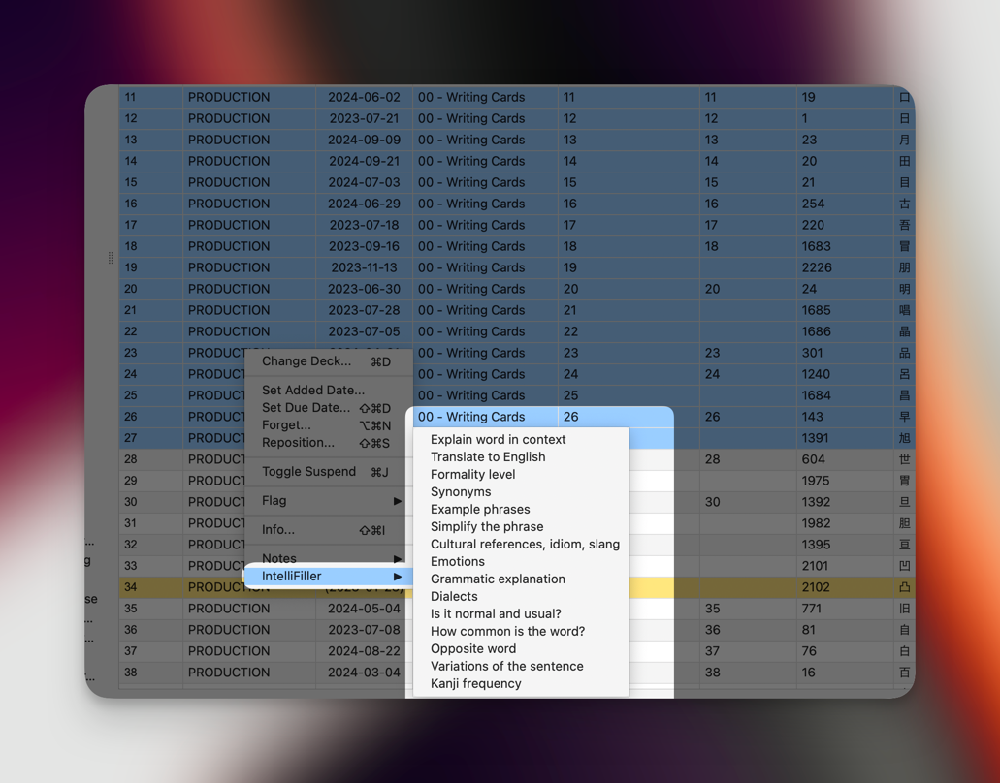
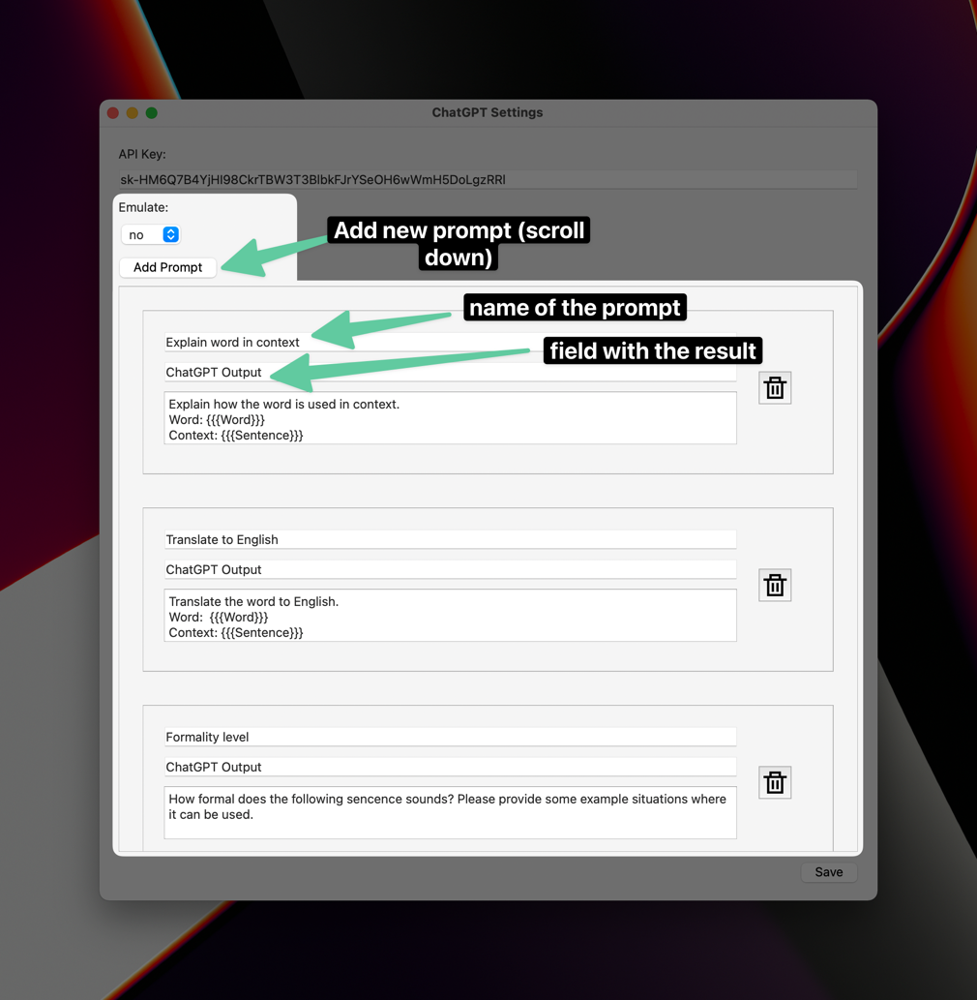
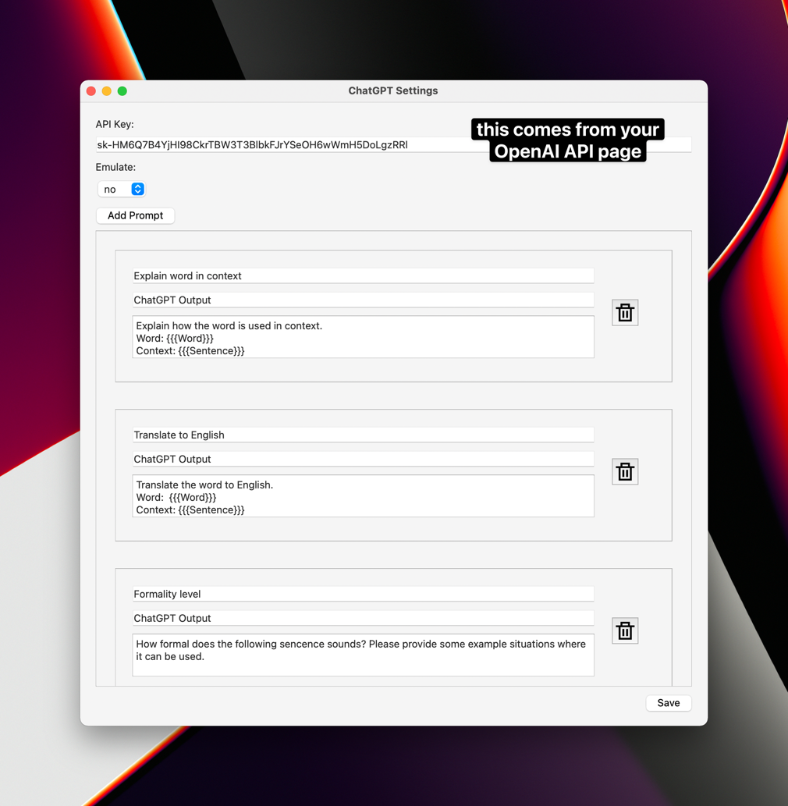

# IntelliFiller LLM addon for Anki

## Features 

### Editor button

This add-on allows you to autofill fields in your cards using ChatGPT or Claude. 

Pick fields from your card and use them in your prompt, for example: 

>Explain the grammar in the following Japanese sentence: {{{Sentence}}}

The result will be saved in the output field of your choice, for example in the "Grammar Explanation" field.  

You can use multiple fields, too, for example: 

>Is the word {{{Word}}} used in a literate or figurative sense in the following sentence? {{{Sentence}}}

### Fill multiple cards
You can pick multiple cards and ask the model to fill their fields! 

In the cards browser, use the Shift key to pick multiple cards. Then right click on them and pick the IntelliFiller menu. You will see the list of prompts. 

### Save your prompts

You can save prompts to reuse them later.

## Installation

Don't forget to restart Anki after you've installed the Add-on! 

You will need to get a ChatGPT or Claude API key. You can sign up using [OpenAI](https://platform.openai.com/account/api-keys) or [Claude](https://console.anthropic.com/settings/keys)

## Cost

Each request to the ChatGPT API costs ~$0.002 (depending on which model you pick), so you should not spend more than a couple of bucks on an average-sized deck. All money goes to OpenAI/Anthropic, not me 😭. 

